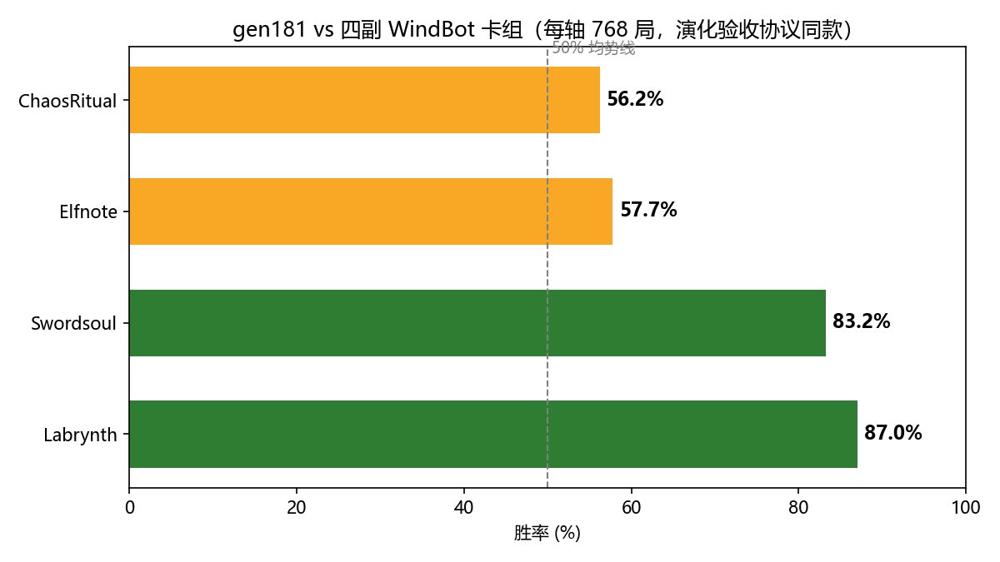

# YGOAI — gen181 WindBot

一个游戏王 AI 机器人：以 **WindBot 的形态**连接任意 ygopro 系服务器（srvpro / 自建 ai_server / 公网服务器），界面双击即用，无需命令行。

底层是自研的神经网络决策核（ocgcore 无头管线 + 候选打分策略头，经由行为克隆 + 硬选择演化训练得到），不是脚本规则 bot。

## 对四个 WindBot 卡组的胜率

gen181（当前版本策略）对四副 WindBot 卡组，每轴 768 局（与训练期演化验收同协议、同卡组镜像）：



| 对手卡组 | 胜率 |
|---|---|
| Labrynth | 87.0% |
| Swordsoul | 83.2% |
| Elfnote | 57.7% |
| ChaosRitual | 56.2% |

## 快速开始

1. 下载 [YGOAI-gen181-v1.zip](../../releases/tag/v1)（12MB）解压到任意目录
2. 双击 `WbGen181.exe`
   - 卡组 / 模型下拉框自动扫描运行目录与 `Decks/`
   - 服务器默认 `127.0.0.1:7911`（本机 `ai_duel --server` 的默认回环端口），连公网服务器改 IP / 端口 / 密码即可
3. 首次启动自动从 [moecube 官方 CDN](https://cdn02.moecube.com:444/ygopro-database/zh-CN/cards.cdb) 下载卡库 `cards.cdb`（约 8MB），「更新卡库」按钮可随时刷新

## 包内容

| 文件 | 说明 |
|---|---|
| `WbGen181.exe` | 图形界面壳（C# WinForms，.NET Framework 4.x 自带） |
| `WbRelay.exe` | 命令行壳（同功能，供脚本调用） |
| `ai_duel.exe` | C++ 决策核（候选打分 + ORT 推理 + 全套对局护栏） |
| `model.onnx` + `.tab` | gen181 策略权重与词表侧车 |
| `Decks/` | 四副预置卡组 |
| VC 运行库三件套 | 目标机器无需另装任何依赖 |

## 架构

```
ygopro 服务器 ←TCP帧→ [C# 壳：纯字节转发] ←stdio帧→ [C++ 决策核 ai_duel]
```

- 帧格式与 ygopro 网络线协议逐字节相同，壳侧零解释
- 决策核为客户端角色重建可见状态（公开镜像 + 自方查询），候选级策略打分出招
- 内置实战护栏：RETRY 排除重选、挂机防 ban 适配、决策洪水熔断、自链手坑守护
- 卡库启动时自动应用超先行 setcode 兼容补丁（幂等）
- 对局回放自动落 `client_replay/*.yrp`

## 命令行用法

```
WbRelay.exe -h <服务器IP> -p <端口> -w <房间密码> -n <名字> [-d 卡组.ydk] [-m model.onnx]
```

## License

代码（`WbGui.cs` / `WbRelay.cs`）按 MIT 提供。`model.onnx` 权重仅供研究与非商业用途。卡库数据归上游（moecube CDN 分发），本仓库不包含。
